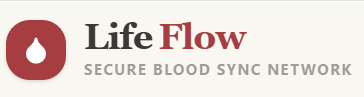

# 🩸 LifeFlow — Emergency Blood Donation & AI Health Advisor Platform

<p align="center">
  
</p>

<p align="center">
  <b>Connecting patients in crisis with life-saving donors — in real time.</b>
</p>

<p align="center">
  <a href="PASTE_YOUR_LIVE_DEPLOYED_URL_HERE"></a>
  <a href="https://ai.google.dev/"></a>
  <a href="https://firebase.google.com/"></a>
  
</p>

<p align="center">
  🔗 <b>Live App:</b> <a href="PASTE_YOUR_LIVE_DEPLOYED_URL_HERE">PASTE_YOUR_LIVE_DEPLOYED_URL_HERE</a>
</p>

---

## 📖 Table of Contents

1. [Overview & Problem Statement](#-1-overview--problem-statement)
2. [Live Application](#-2-live-application)
3. [Screenshots](#-3-screenshots)
4. [Features](#-4-features)
5. [AI Feature — Eligibility & Health Advisor](#-5-ai-feature--eligibility--health-advisor)
6. [Tech Stack & Services](#-6-tech-stack--services)
7. [Project Architecture](#-7-project-architecture)
8. [Getting Started (Run Locally)](#-8-getting-started-run-locally)
9. [Deployment](#-9-deployment)
10. [Roadmap](#-10-roadmap)
11. [License](#-license)

---

## 📌 1. Overview & Problem Statement

### What is LifeFlow?

**LifeFlow** is an end-to-end emergency blood donation network combined with an AI-powered health advisor. It closes the gap between people who urgently need blood and the nearby donors who can give it — while also helping potential donors understand, in plain language, whether they're currently eligible to donate.

### The Problem It Solves

In medical emergencies — trauma, surgery, childbirth complications, chronic illness — finding compatible blood **fast** can be the difference between life and death. Today, that search is fragmented across:

- 📉 **Understocked blood banks** that can't always meet urgent, rare-type demand.
- 📱 **Scattered social media pleas** (WhatsApp groups, Facebook posts) that are slow, unverified, and impossible to filter by blood group, distance, or urgency.
- ❓ **Donor uncertainty** — millions of willing donors self-disqualify or get turned away because they aren't sure if a recent tattoo, medication, illness, or trip abroad makes them temporarily ineligible.

**LifeFlow solves this by providing:**

| Who | Problem | How LifeFlow Helps |
|---|---|---|
| 🚑 **Patients & families** | Need compatible blood *now*, from a trustworthy, local source | Post a request instantly; compatible donors within range are auto-notified |
| 🩸 **Voluntary donors** | Want to help but don't know where/when they're needed, or if they even qualify | Real-time nearby request feed + instant AI eligibility guidance before they show up |
| 🏥 **Hospitals & blood banks** | Need to widen their donor pool beyond registered walk-ins | A searchable, verified directory of nearby donors by blood group and availability |

**Target audience:** emergency patients and their families, voluntary blood donors, and community health coordinators who need a faster, smarter alternative to word-of-mouth blood requests.

---

## 🌐 2. Live Application

| Resource | Link |
|---|---|
| 🔗 **Live Deployed App** | [PASTE_YOUR_LIVE_DEPLOYED_URL_HERE](PASTE_YOUR_LIVE_DEPLOYED_URL_HERE) |
| 💻 **Source Code (GitHub)** | [PASTE_YOUR_GITHUB_REPO_URL_HERE](PASTE_YOUR_GITHUB_REPO_URL_HERE) |

> No installation needed to try it out — open the live link above. Use the **Guest Donor Login** for the fastest way to explore the app without creating an account.

---

## 🖼️ 3. Screenshots

<table>
  <tr>
    <td align="center"><b>Home Feed & Emergency Requests</b></td>
    <td align="center"><b>AI Eligibility & Health Advisor</b></td>
  </tr>
  <tr>
    <td></td>
    <td></td>
  </tr>
  <tr>
    <td align="center"><b>Nearby Donor Directory & Compatibility Search</b></td>
    <td align="center"><b>Emergency Request Detail & Direct Dispatch</b></td>
  </tr>
  <tr>
    <td></td>
    <td></td>
  </tr>
  <tr>
    <td align="center"><b>Authentication</b></td>
    <td align="center"><b>Notification Center</b></td>
  </tr>
  <tr>
    <td></td>
    <td></td>
  </tr>
</table>

> _Replace the placeholder images above with actual screenshots stored in the `/assets` folder before publishing._

---

## ✨ 4. Features

### 🩸 Emergency Blood Request System
- **Real-time request feed** — browse active emergency requests, filterable by blood group, urgency level (Critical / Urgent / Standard), and distance radius.
- **Proximity-based matching** — uses the Haversine formula to calculate real distance (in km) between a donor and the patient/hospital location.
- **Automated emergency alerts** — publishing a new request instantly notifies all compatible, registered donors within a 20 km radius.
- **Request detail view** — full patient/hospital context, urgency, and one-tap ways to respond.

### 🤖 AI Blood Donor Eligibility & Health Advisor
- **Instant medical guidance** on donation eligibility questions (tattoos, medications, recent illness, travel, surgery, donation frequency, etc.).
- **One-click preset scenarios** for fast, common questions.
- **Context-aware answers** — factors in the user's age, weight, and blood group for a tailored response.
- **Structured, actionable output** — every answer includes an eligibility status, medical explanation, recommended deferral period, and a medical disclaimer.
- **Graceful fallback** — if the AI service is unavailable, the app still returns general WHO/Red Cross-aligned guidance instead of failing silently.

### 👥 Donor Directory & Search
- **ABO/Rh compatibility engine** — matches universal donors (O−), universal recipients (AB+), and all specific antigen compatibility combinations.
- **Live availability status** — donors can toggle their availability and see their last donation date.
- **Direct email dispatch** — send an emergency alert email straight to a compatible donor from within the app.

### 🔔 Notifications & User Profiles
- **Notification Center** — badge counter and drawer showing emergency alerts, request updates, and donor responses.
- **Editable profiles** — manage blood group, location coordinates, availability, and contact details.
- **Multi-mode authentication** — Firebase Email/Password, one-click Guest Donor login, and Google OAuth sign-in.

---

## 🧠 5. AI Feature — Eligibility & Health Advisor

### What it does

The **AI Blood Donor Eligibility & Health Advisor** is a conversational medical-guidance module built directly into LifeFlow. When a user (potential donor) asks a question — e.g. *"I got a tattoo two months ago, can I donate blood?"* — the app sends the question, along with the user's blood group, age, and weight, to **Google's Gemini 3.6 Flash** model, which returns a structured, easy-to-read answer grounded in international blood-donation safety guidelines (WHO / American Red Cross / NHS).

This turns a common source of donor hesitation and confusion into an instant, judgment-free, structured answer — increasing the number of eligible donors who actually complete a donation.

### System Instruction (the AI's persona & rules)

```text
You are the AI Blood Donor Eligibility & Health Advisor.
You assist potential blood donors with medical eligibility questions regarding
tattoos, medications, travel, surgeries, illnesses, and donation frequency.
Provide accurate, clear, bulleted medical guidance.
Always include a short disclaimer that final eligibility is determined
at the donation center during physical screening.
```

### Prompt Template (per-request context injected by the app)

```text
User Context:
- Question: "${question}"
- User Blood Group: ${bloodGroup || "Unspecified"}
- Age: ${age || "Unspecified"}
- Weight: ${weightKg ? weightKg + " kg" : "Unspecified"}

Provide a clear, helpful, empathetic response following standard international
blood donation guidelines (WHO / American Red Cross / NHS).
Include:
1. Eligibility Status (Likely Eligible / Temporary Deferral / Permanent Deferral / Needs Blood Bank Review)
2. Medical Explanation & Guidelines
3. Recommended Deferral Period (if applicable)
4. Important Medical Disclaimer
```

### How it's called

- **Model:** `gemini-3.6-flash` (via the `@google/genai` SDK)
- **Temperature:** `0.3` (favoring consistent, factual answers over creative variance)
- **Endpoint:** `POST /api/eligibility-advisor` — implemented as a Vercel Serverless Function for production (`api/eligibility-advisor.ts`) and mirrored by an Express route (`server.ts`) for local development.
- **Fallback behavior:** if `GEMINI_API_KEY` is not configured, the endpoint still returns useful general donation guidance rather than an error, so the feature degrades gracefully instead of breaking.

---

## 🛠️ 6. Tech Stack & Services

| Layer | Technology / Service | Purpose |
|---|---|---|
| **Frontend** | React 19, TypeScript, Vite 6 | Fast, type-safe, component-driven UI |
| **Styling & UI** | Tailwind CSS 4, Lucide Icons, Motion | Responsive, accessible, animated design system |
| **Backend Server** | Express.js + Node.js (dev), Vercel Serverless Functions (prod) | API layer serving the AI advisor endpoint |
| **AI Integration** | Google Gen AI SDK (`@google/genai`) — **Gemini 3.6 Flash** | Powers the AI Eligibility & Health Advisor |
| **Database** | Firebase Firestore | Stores users, blood requests, donor profiles, and notifications |
| **Authentication** | Firebase Auth (Email/Password, Google OAuth, Guest login) | Secure, multi-method user authentication |
| **Markdown Rendering** | `react-markdown` | Renders structured, formatted AI responses |
| **Bundling & Build** | Vite, esbuild, TypeScript compiler | Production build pipeline |
| **Hosting** | Vercel | CI/CD deployment for both the SPA and serverless API routes |

---

## 🏗️ 7. Project Architecture

```
blood-donation/
├── api/
│   └── eligibility-advisor.ts     # Vercel serverless function (production AI endpoint)
├── server.ts                      # Express server (local dev API + static serving)
├── src/
│   ├── components/                # UI components (feed, modals, search, navbar, etc.)
│   ├── context/
│   │   └── AuthContext.tsx        # Global auth state (Firebase)
│   ├── utils/
│   │   └── bloodCompatibility.ts  # ABO/Rh compatibility + distance logic
│   ├── firebase.ts                # Firebase app/auth/Firestore initialization
│   ├── types.ts                   # Shared TypeScript types
│   └── App.tsx                    # Root application component
├── firestore.rules                # Firestore security rules
├── index.html
├── vite.config.ts
└── package.json
```

**Request flow (AI Advisor):**
`EligibilityAdvisorModal.tsx` → `POST /api/eligibility-advisor` → Gemini 3.6 Flash (system instruction + user context prompt) → structured Markdown response → rendered via `react-markdown`.

---

## 🚀 8. Getting Started (Run Locally)

### Prerequisites
- **Node.js** v18 or higher
- **npm** (or yarn/pnpm)
- A **Firebase** project (Firestore + Authentication enabled)
- A **Google Gemini API key** ([Google AI Studio](https://ai.google.dev/))

### 1. Clone the repository
```bash
git clone PASTE_YOUR_GITHUB_REPO_URL_HERE
cd blood-donation
```

### 2. Install dependencies
```bash
npm install
```

### 3. Configure environment variables
Create a `.env` file in the project root:

```env
# Gemini API Key — required for the AI Eligibility Advisor
GEMINI_API_KEY=your_gemini_api_key_here

# Firebase Configuration — required for Auth & Firestore
VITE_FIREBASE_API_KEY=your_firebase_api_key
VITE_FIREBASE_AUTH_DOMAIN=your_project.firebaseapp.com
VITE_FIREBASE_PROJECT_ID=your_project_id
VITE_FIREBASE_STORAGE_BUCKET=your_project.appspot.com
VITE_FIREBASE_MESSAGING_SENDER_ID=your_sender_id
VITE_FIREBASE_APP_ID=your_app_id

# Optional — only needed if using a named Firestore database instead of "(default)"
VITE_FIREBASE_FIRESTORE_DATABASE_ID=
```

### 4. Start the development server
```bash
npm run dev
```
The app will be available at [http://localhost:3000](http://localhost:3000).

### 5. Type-check the project
```bash
npm run lint
```

### 6. Build for production
```bash
npm run build
npm start
```

---

## ☁️ 9. Deployment

LifeFlow is designed to deploy seamlessly on **Vercel**:

1. Push the repository to GitHub.
2. Import the project into [Vercel](https://vercel.com/new).
3. Add all environment variables listed above (`GEMINI_API_KEY`, `VITE_FIREBASE_*`) under **Project Settings → Environment Variables**.
4. Vercel automatically detects `api/eligibility-advisor.ts` as a serverless function and deploys the Vite SPA as static output — no additional configuration required.
5. Once deployed, replace the placeholder link at the top of this README with your live URL.

---

## 🗺️ 10. Roadmap

- [ ] SMS/WhatsApp alert integration for donors without app access
- [ ] Blood bank inventory integration for hospitals
- [ ] Multi-language support for the AI Advisor
- [ ] Donor gamification (badges, donation streaks, leaderboards)
- [ ] Progressive Web App (PWA) offline support

---

## 📄 License

This project is open-source and available under the [MIT License](LICENSE).

---

<p align="center">Built with ❤️ to help save lives, one donation at a time.</p>
